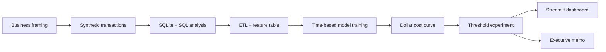

# Ledgerly Fraud Risk & Credit Loss Analytics

Portfolio-grade risk analytics capstone translating fraud probabilities into an operating threshold and a dollar-valued decision.

> Status: complete and locally verified. All reported metrics are generated by the reproducible pipeline.

## Business problem

Ledgerly is a fictional payments platform facing rising fraud and chargeback losses. Leadership must decide where to set the fraud decision threshold while balancing loss prevention, customer experience, support expense, and growth.

## My role

Business Analyst, Data Analyst, and Product Risk Analyst: frame the decision, engineer synthetic data, analyze concentration, train and evaluate models, optimize the threshold on dollars, validate it through an experiment, and package the recommendation for executives.

## Tools

Python, pandas, NumPy, Faker, scikit-learn, SQLite, SQL, Jupyter, Plotly, Streamlit, and joblib.

## Key findings and business impact

- Analyzed **200,000 transactions** with a realistic **2.65% fraud rate**; documented why 97.35% naive accuracy detects no fraud.
- Built leakage-safe models using January–September for training, October for calibration, and November–December for testing; gradient boosting reached **0.623 ROC-AUC / 0.061 PR-AUC**.
- Optimized the decision on dollars rather than F1: recommended threshold **0.101**, producing **$4,901 held-out savings** and **$29,408 annualized** at synthetic volume while staying below the 2% CX guardrail.
- Designed a four-week 20% holdout test and an interactive Streamlit simulator that exposes fraud dollars blocked versus legitimate-customer cost.

## Architecture



## Repository map

| Folder | Purpose |
|---|---|
| `01-business-case` | Discovery, stakeholder tension, assumptions, decision constraints |
| `02-data` | Reproducible synthetic data, DDL, local database loader |
| `03-etl-and-analysis` | SQL analysis, ETL, EDA notebook |
| `04-modeling` | Leakage-safe preprocessing, models, evaluation |
| `05-cost-based-decisioning` | Dollar-cost translation and threshold optimization |
| `06-experiment` | Experiment design, simulation, inference, power |
| `07-product-strategy` | Metric tree and RICE prioritization |
| `08-dashboard` | Deployable Streamlit decision simulator |
| `09-executive-memo` | CFO/Head of Risk recommendation |

## Run locally

```bash
python -m venv .venv
.venv\Scripts\activate
pip install -r 08-dashboard/requirements.txt
python run_pipeline.py
streamlit run 08-dashboard/app.py
```

The dashboard reads committed/cached extracts and pretrained models; it does not train live and requires no external database.

## Analytical design choices

- Fraud is intentionally rare, so accuracy is not a useful primary metric: an always-legitimate classifier can exceed 97% accuracy while detecting no fraud.
- The split is chronological rather than random to better represent deployment and prevent future behavior leaking into training.
- The operating threshold minimizes expected dollar cost, not F1 or accuracy.

## Limitations

This capstone uses synthetic labels and simplified decision economics. Production work would add real-time feature serving, graph-based fraud-ring detection, review capacity constraints, fairness monitoring, delayed-label handling, and concept-drift controls.

## So what?

The project makes the core risk tradeoff inspectable: how much fraud loss Ledgerly prevents for each dollar and customer relationship put at risk by false declines.
